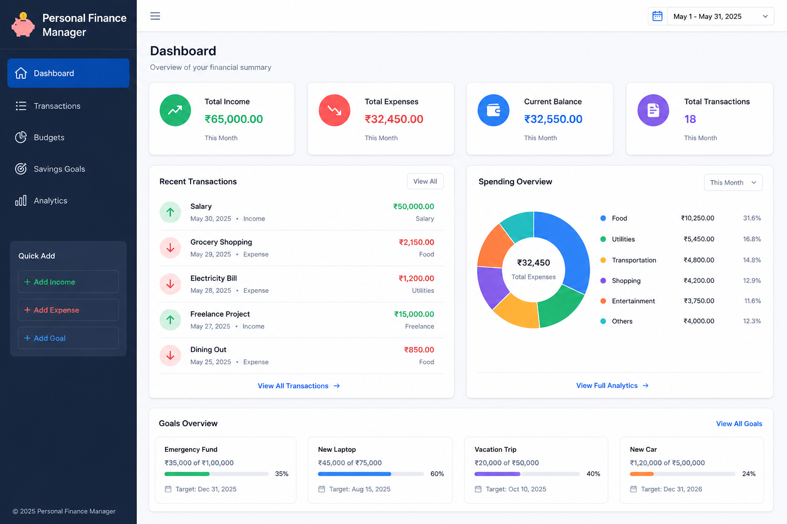

# 💰 Personal Finance Manager


---

<p align="center">
  
</p>

---

# 🌟 About The Project

**Personal Finance Manager** is a modern, responsive, and practical finance-management web application built primarily with **Python, Flask, and SQLite**, with **HTML, CSS, and Vanilla JavaScript** powering the frontend.

The project provides a simple way to record income and expenses, manage category-based budgets, track savings goals, and understand monthly spending patterns through financial analytics.

The application focuses on:

- Python-first backend development
- Flask routing and server-side logic
- SQLite database management
- Complete CRUD operations
- Transaction tracking
- Budget management
- Savings goal tracking
- Monthly financial analytics
- Clean and responsive UI/UX
- Simple and maintainable project architecture

---

# ✨ Features

## 💸 Transaction Management

✔ Add income transactions

✔ Add expense transactions

✔ Edit existing transactions

✔ Delete transactions

✔ Categorize transactions

✔ Add descriptions and dates

✔ Search transactions

✔ Filter transactions by type and category

✔ Filter transactions by date range

✔ Automatically calculate total income

✔ Automatically calculate total expenses

✔ Automatically calculate current balance

---

## 💰 Budget Management

✔ Create category-based budgets

✔ Update existing budgets

✔ Delete budgets

✔ Track spending against each budget

✔ Calculate remaining budget

✔ Calculate budget usage percentage

✔ Monitor spending by category

---

## 🎯 Savings Goals

✔ Create savings goals

✔ Set target amounts

✔ Record saved amounts

✔ Set optional deadlines

✔ Add goal descriptions

✔ Edit existing goals

✔ Delete goals

✔ Calculate remaining amount

✔ Track goal completion percentage

✔ Display goal progress

---

## 📊 Financial Analytics

✔ Select a specific month

✔ View monthly income

✔ View monthly expenses

✔ Calculate monthly savings

✔ Calculate savings rate

✔ Count monthly transactions

✔ Identify top spending category

✔ View category-wise spending

✔ View daily spending

---

## 🎨 Design & UX

✔ Modern professional interface

✔ Responsive layout

✔ Clean navigation

✔ Reusable Jinja2 templates

✔ Flash notifications

✔ User-friendly forms

✔ Confirmation before deletion

✔ Progress indicators

✔ Empty states

✔ Accessible and straightforward UI

---

# 🛠 Tech Stack

## Backend


Python handles the application logic, routing, validation, calculations, and database operations.

---

## Database


SQLite provides lightweight persistent storage for:

- Transactions
- Budgets
- Savings Goals

---

## Frontend


The frontend uses Jinja2 templates, HTML, CSS, and Vanilla JavaScript.

---

## Tools


---

# 📂 Project Structure

```text
Personal-Finance-Manager/

│
├── app.py
├── database.py
├── requirements.txt
├── README.md
│
├── templates/
│   ├── base.html
│   ├── index.html
│   ├── transactions.html
│   ├── add_transaction.html
│   ├── edit_transaction.html
│   ├── budgets.html
│   ├── add_budget.html
│   ├── edit_budget.html
│   ├── analytics.html
│   ├── goals.html
│   ├── add_goal.html
│   └── edit_goal.html
│
└── static/
    ├── css/
    │   └── style.css
    │
    └── js/
        ├── script.js
        └── analytics.js
```

`app.py` handles Flask routes, requests, validation, redirects, and page rendering.

`database.py` contains the SQLite connection, table initialization, CRUD operations, financial calculations, budget tracking, goal tracking, and analytics functions.

The `templates` directory contains the Jinja2-based HTML interface.

The `static` directory contains the application's CSS and JavaScript.

---

# 🚀 Installation & Setup

Clone the repository:

```bash
git clone https://github.com/Aadi6386/Personal-Finance-Manager.git
```

Navigate into the project:

```bash
cd Personal-Finance-Manager
```

Install the required dependency:

```bash
pip install -r requirements.txt
```

Run the application:

```bash
python app.py
```

Then open the local Flask address shown in the terminal.

---

# 🗄️ Database

The application uses SQLite and automatically initializes the database when Flask starts.

The database file is:

```text
finance.db
```

The application creates the required tables automatically.

## Transactions

Stores:

- Transaction type
- Amount
- Category
- Description
- Date

## Budgets

Stores:

- Category
- Budget amount

## Goals

Stores:

- Goal name
- Target amount
- Saved amount
- Deadline
- Description

---

# 🔄 Application Flow

```text
User
  ↓
HTML / CSS / JavaScript
  ↓
Flask Routes
  ↓
Python Application Logic
  ↓
SQLite Database
  ↓
Financial Calculations
  ↓
Jinja2 Templates
  ↓
Updated Interface
```

---

# 📚 Learning Outcomes

During this project I improved my understanding of:

- Python programming
- Flask web development
- SQLite database management
- SQL queries
- CRUD operations
- Database connections
- Server-side validation
- Flask routing
- Jinja2 templating
- HTML5
- CSS
- JavaScript
- DOM manipulation
- Form handling
- Search and filtering
- Financial calculations
- Basic data analytics
- Responsive web design
- Git workflow
- GitHub repository management
- Project structure and organization

---

# 🧮 Financial Calculations

## Balance

```text
Balance = Total Income - Total Expenses
```

## Monthly Savings

```text
Monthly Savings = Monthly Income - Monthly Expenses
```

## Savings Rate

```text
Savings Rate =
(Monthly Savings / Monthly Income) × 100
```

## Budget Usage

```text
Budget Usage =
(Amount Spent / Budget Amount) × 100
```

## Goal Progress

```text
Goal Progress =
(Saved Amount / Target Amount) × 100
```

---

# 🔄 Project Evolution

## 🚀 Version 1.0.0 — Initial Release

The initial Personal Finance Manager application focused on building a Python-first finance management system using Flask and SQLite.

### Added

✨ Flask application structure

✨ SQLite database

✨ Transaction management

✨ Income and expense tracking

✨ Budget management

✨ Monthly analytics

✨ Savings goals

✨ Responsive frontend

✨ CRUD functionality

---

# 📅 Version History

| Version | Release | Description |
|---------|---------|-------------|
| 1.0.0 | 2026 | Initial Personal Finance Manager release |

---

# 🛣 Future Improvements

Planned enhancements may include:

- 🔐 User authentication
- 👤 Multiple user accounts
- 🔁 Recurring transactions
- 📅 Recurring expenses
- 📊 Interactive financial charts
- 📈 Income vs expense visualization
- 📥 CSV export
- 📄 PDF financial reports
- 🌙 Dark mode
- ☁️ Cloud database support
- 🔌 REST API
- 📱 Enhanced mobile experience
- 🚀 Cloud deployment

---

# 📌 Project Status

🟢 **Active Development**

Personal Finance Manager is being developed as part of my Python and full-stack development journey.

---

# 👨‍💻 Author

## Aaditya Singh

🎓 B.Tech CSE Student

💻 Interested in:

- Python
- Web Development
- Java
- Data Structures & Algorithms
- Machine Learning

---

## 🌐 Connect With Me

[](https://www.linkedin.com/in/aaditya-singh-8349a6371/)

[](https://github.com/Aadi6386)

[](mailto:aadi6386@yahoo.com)

---

# ⭐ Support

If you like this project, consider giving the repository a ⭐.

It motivates me to continue learning, building, and improving open-source projects.

---

# 📜 License

This project is licensed under the **MIT License**.

See the `LICENSE` file for more information.

---

## ❤️ Thank you for visiting this repository!
